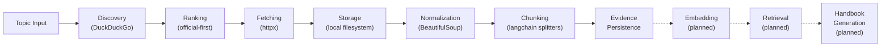

# Noesis Repository Analysis

## What Is Noesis?

Noesis is a **handbook-generation engine** — a Python-based system that accepts a learning topic (e.g., "system design", "game theory"), gathers authoritative web sources, processes them through a multi-phase pipeline, and will ultimately produce **source-cited Markdown handbooks** optimized for exam/interview preparation.

The vision is a local-first, BYO-key tool (not a SaaS) with a Python engine for ingestion/retrieval/generation and a future TypeScript shell for UI.

---

## Architecture Overview

---

## Current Progress

| Phase | Status | Description |
|-------|--------|-------------|
| **Phase 1** | ✅ Completed | Raw source acquisition — topic search, fetch, persist |
| **Phase 2** | ✅ Completed | HTML normalization — clean text, headings, links extraction |
| **Phase 3** | ✅ Code Implemented, Checklist says "planned" | Evidence chunking — paragraph splitting, oversized fallback, persistence |
| **Phase 4+** | 🔲 Not started | Embedding, retrieval, coverage planning, handbook generation |

> **IMPORTANT:** Phase 3 code is fully implemented and tested, but `progress-checklist.md` still marks it as `planned` with unchecked boxes. This is a documentation/code desync.

---

## Codebase Map

### Source Modules (`src/noesis/`)

| File | Lines | Purpose |
|------|-------|---------|
| `models.py` | 98 | 6 dataclasses: `SourceCandidate`, `FetchResult`, `CollectedSource`, `AcquisitionRun`, `NormalizedHtmlDocument`, `NormalizedLink`, `EvidenceChunk` |
| `discovery.py` | 52 | `DDGSDiscoverer` — wraps DuckDuckGo search, classifies sources as `official`/`secondary` |
| `ranking.py` | 12 | Simple sort: official sources first, then alphabetical by domain |
| `fetching.py` | 51 | `HttpSourceFetcher` — httpx GET with redirect-following, published-date extraction from meta tags |
| `orchestrator.py` | 58 | `collect_topic_sources()` — the Phase 1 pipeline: discover → rank → fetch → collect |
| `normalization.py` | 166 | Phase 2 pipeline: parse HTML with BeautifulSoup, select best content root, extract title/headings/text/links, filter noise links |
| `chunking.py` | 77 | Phase 3 pipeline: split normalized text into paragraph-level evidence chunks, oversized fallback via `langchain-text-splitters` |
| `storage.py` | 62 | Filesystem persistence: save raw corpus, metadata, and evidence chunks as JSON |
| `cli.py` | 66 | CLI with 3 subcommands: `collect`, `normalize`, `chunk` |

### Tests (`tests/`)

| File | Tests | Coverage |
|------|-------|----------|
| `test_phase1_collection.py` | 5 | Prioritization, fetch cap, failure tolerance, unique run IDs, corpus persistence |
| `test_phase2_normalization.py` | 4 | Article extraction, hub link preservation, non-HTML skipping, content-root selection |
| `test_phase3_chunking.py` | 6 | Paragraph chunking, oversized splitting, dense-text character fallback, persistence, CLI |

### Documentation (`docs/`)

| File | Purpose |
|------|---------|
| `noesis-mvp-plan.md` | Master plan — product boundary, architecture, engine subsystems, TypeScript shell, test plan |
| `progress-checklist.md` | Phase-by-phase checklist tracking implementation progress |
| `superpowers/specs/evidence-retrieval-design.md` | Approved spec for evidence processing and retrieval architecture (SQLite + LanceDB) |
| `superpowers/plans/phase-3-evidence-chunking.md` | TDD-style implementation plan for Phase 3 chunking (6 tasks, all implemented) |

### Data (`data/raw-runs/`)

4 existing test runs from real collection:
- `game-theory/`
- `game-theory-a2f76b0c/`
- `system-design-c2e1b480/`
- `system-design-for-faang-interviews-715ba3a1/`

---

## Dependencies

| Package | Version | Purpose |
|---------|---------|---------|
| `beautifulsoup4` | ≥4.13.0 | HTML parsing and content extraction |
| `ddgs` | ≥9.5.0 | DuckDuckGo search API |
| `httpx` | ≥0.28.0 | HTTP client with redirect support |
| `langchain-text-splitters` | ≥0.3.8 | Recursive character-based text splitting for oversized paragraphs |
| `pytest` | ≥8.4.0 | Testing (dev dependency) |

- **Python**: ≥3.14 (cutting-edge requirement)
- **Build**: setuptools ≥80.0

---

## Key Design Decisions

1. **Official-first source policy** — Sources from `.gov`, `.edu`, `docs.*`, `developer.*`, `learn.*`, and major cloud provider domains are classified as `official` and ranked above `secondary` sources.

2. **Content-root scoring** — Normalization selects the richest content root (`<article>`, `<main>`, or `<body>`) using a composite score of text length + paragraph count + heading count + link count. This avoids picking shallow promo blocks over deep content regions.

3. **Noise link filtering** — Social media domains and auth/privacy/share paths are filtered out during link extraction.

4. **Small-to-big chunking** — Chunks are paragraph-level but carry `parent_paragraph_text` for expansion back to full paragraph context during retrieval. Oversized paragraphs split by character count using `RecursiveCharacterTextSplitter`.

5. **Filesystem-first storage** — All data persists as JSON files in `data/raw-runs/<run-id>/`. The spec approves a future move to SQLite + LanceDB.

6. **Stub/mock-based testing** — Tests use in-process stubs (`StubDiscoverer`, `StubFetcher`) rather than mocking libraries, keeping tests readable and explicit.

---

## Observations & Potential Issues

### 1. Documentation Desync (Phase 3)
Phase 3 in `progress-checklist.md` is marked "planned" with all boxes unchecked, but the code (`chunking.py`, `EvidenceChunk` model, CLI `chunk` subcommand, and 6 tests) is fully implemented.

### 2. Type Signature Issue in fetching.py
`_extract_published_date` (line 32) has type hint `raw_html: bytes` but is called with `response.text` (a `str`) on line 21. The function body then calls `.decode()` on it, which would fail on a `str` in strict typing. It works at runtime because the `try/except` swallows the error and returns `None`, but the type hint is misleading.

### 3. Heading Path is Simplified
`_build_heading_path` in chunking.py only takes the first heading, not a true section-aware heading path. The spec mentions "heading path" as a rich structural attribute for retrieval. This is a known simplification noted as "conservative" in the plan.

### 4. No `__init__.py` in tests
Tests work via pytest discovery without an `__init__.py`, which is fine for pytest but worth noting.

### 5. Unused `output_root` Parameter
`orchestrator.py:18` explicitly deletes the `output_root` parameter (`del output_root`). The storage save happens in the CLI layer instead. This is a deliberate design choice to keep orchestration storage-agnostic.

### 6. Git History
Only 2 commits exist — the initial commit and a single feature commit. All Phase 1–3 work appears to be in a single commit, suggesting the code was developed in a single session or squashed.

---

## What Comes Next (Per the Spec)

The evidence-retrieval-design spec lays out the approved next steps:

1. **Embedding** — Eager embedding after chunking (OpenAI recommended default, local optional)
2. **SQLite** — Application state, structured records, chunk metadata
3. **LanceDB** — Vector retrieval over chunk embeddings
4. **Hybrid retrieval** — Semantic + lexical + metadata filtering
5. **Coverage planning** — Map required subtopics to evidence before generation
6. **Handbook generation** — Produce cited Markdown handbooks from evidence

### Open Decisions (from spec)
- Retrieval scoring formula (semantic + lexical + tier weighting)
- Whether to add reranking in MVP
- Exact chunk schema details for SQLite
- Boundary between retrieval and handbook planning
- Post-generation retention lifecycle
