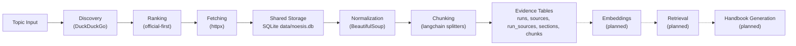

# Noesis Repository Analysis

## What Is Noesis?

Noesis is a handbook-generation engine that accepts a topic, gathers web sources, normalizes source content into structured sections, chunks that evidence for retrieval, and is intended to feed later embedding, retrieval, and handbook-generation phases.

The current implementation is local-first and now uses shared `SQLite` as the primary evidence store.

---

## Architecture Overview

---

## Current Progress

| Phase | Status | Description |
|-------|--------|-------------|
| **Phase 1** | ✅ Completed | Topic-based source collection |
| **Phase 2** | ✅ Completed | HTML normalization into structured sections and links |
| **Phase 3** | ✅ Completed | Evidence chunk generation |
| **Phase 4** | ✅ Completed | Structured SQLite persistence foundation |
| **Phase 5** | ✅ Completed | DB-first collect/normalize/chunk pipeline with shared storage and source reuse |
| **Phase 6+** | 🔲 Planned | Embeddings, retrieval, handbook generation |

---

## Current Pipeline

Primary workflow:

1. `noesis collect <topic>`
2. `noesis normalize <run_id>`
3. `noesis chunk <run_id>`

Primary storage:

- `data/noesis.db`
- tables: `runs`, `sources`, `run_sources`, `sections`, `chunks`

Legacy filesystem artifacts under `data/raw-runs/` are no longer part of the primary workflow. They remain available only through explicit debug-only CLI usage.

---

## Codebase Map

### Source Modules (`src/noesis/`)

| File | Purpose |
|------|---------|
| `models.py` | Core dataclasses for sources, runs, normalized documents, and chunks |
| `discovery.py` | DuckDuckGo discovery and source classification |
| `ranking.py` | Official-first candidate ordering |
| `fetching.py` | HTTP fetch and metadata extraction |
| `orchestrator.py` | DB-first collection path, source reuse, in-process normalize+chunk on fetch |
| `normalization.py` | HTML normalization for both legacy run folders and shared SQLite runs |
| `chunking.py` | Chunk generation for both legacy run folders and shared SQLite runs |
| `storage.py` | Legacy artifact persistence plus shared SQLite schema and read/write helpers |
| `cli.py` | DB-first CLI with explicit debug-only raw-run path support |

### Tests (`tests/`)

| File | Coverage |
|------|----------|
| `test_phase1_collection.py` | Collection behavior and raw corpus persistence |
| `test_phase2_normalization.py` | HTML normalization and debug-path CLI behavior |
| `test_phase3_chunking.py` | Filesystem chunk generation and debug-path CLI behavior |
| `test_phase4_sqlite_storage.py` | Run-scoped SQLite persistence for legacy migration path |
| `test_source_reuse.py` | URL canonicalization and TTL refresh logic |
| `test_source_reuse_integration.py` | Shared-DB collection and cross-run source reuse |
| `test_phase5_db_normalization.py` | Shared-DB normalize behavior |
| `test_phase5_db_chunking.py` | Shared-DB chunk behavior |

---

## Key Design Decisions

1. **Shared SQLite is canonical** — The primary evidence pipeline writes and reads from `data/noesis.db`.
2. **Run/source separation** — `run_sources` links a run to reusable canonical sources instead of duplicating source rows across runs.
3. **Normalization stores sections, not flattened text** — Structured `sections` with `heading_path` and `paragraphs` are the canonical normalized form.
4. **Chunking is section-aware** — Chunks preserve source metadata and paragraph lineage for later small-to-big retrieval.
5. **Raw-run artifacts are debug-only** — Files like `normalized.json` and `chunks.json` are no longer canonical outputs.

---

## Current Gaps

Phase 5 is now complete. The main remaining work is Phase 6:

- embedding generation
- vector storage
- retrieval APIs
- handbook generation

There is also still historical migration code and debug-path support for raw-run folders, but that is no longer the main execution path.
